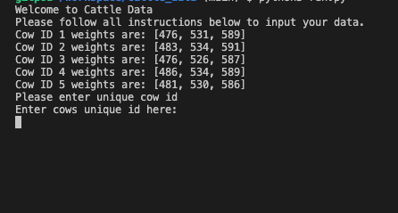
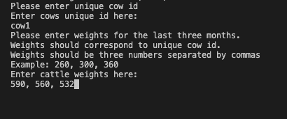
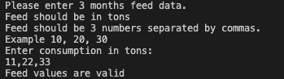
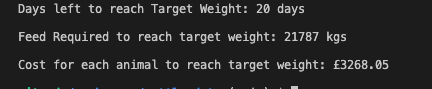

# Cattle Data

Cattle data is a python terminal application for feedlot users looking to fatten cattle to the industry standard 750kg weight to be sent to market.
Users are able to input their cattle weights and feed consumption and the application processes that data and returns a report telling the user how long until cattle are likely to reach that target weight and how many kilograms of food they will require to reach that target and at what cost to the user. The inputed data is sent to a google sheet and stored. Future use of the application loads that data and allows the user to add new cattle or by entering an exsisting cow id can put new weight data in for an existing animal.

## How it works

Upon opening the application users will be presented with data of the previous cattle id's and weights. 

Users are presented with an input allowing them to enter an individual cow id followed by the three most recent weights of that animal, based on accepted industry standard for monthly weighing.

Once they have entered the first animal they are able to repeat the process until they have entered either their entire herd or all the animals they wish to analyse. Analysis of just one animal is also possible.

Once user has inputted cattle data the application requests the feed consumption from the same three months. Feed inputs are taken in tons and specific month data is not required from the user. Instead average calculations in the application are based on a month length of 31Days.

Once they submit that data the application processes that data and returns a report to the user with:
- the time left before animals have reached the target weight of 750kg, 
- the amount of food each animal requires to achieve that weight and 
- the cost of that food based on an industry average of £150 per ton.

The weight and feed information will then be uploaded to an external worksheet using gspread so the users data is available in a excel format. This means every time the user returns they will be able to add more cattle to the database or by entering the same cow id as before the new weights for that animal will replace the old ones.

## Existing Features

- Upon loading the application a list of the current cows in the users sheet is printed to the terminal for a quick review.

- Users are then greeted with a detailed list of instructions as to what information they are required to input into the terminal. Starting With Cattle id and then 3 weights for that cow. 

- Data is then validated and user is presented with the option to add another animal to the data set or not. 

- If user enters duplicate cow id's only the values for the last entry of that id will be used by the program for analysis. 

- Once all the animals have been added to the data set the user is then prompted to enter three feed intake values that correspond to those cattle. That data input is validated and once validated will be added to a google sheet.  

- Once data has been validated it passes through the application and is returned to the user in the terminal as a report detailing:
	- the time left before animals have reached the target weight of 750kg, 
	- the amount of food each animal requires to achieve that weight and 
	- the cost of that food based on an industry average of £150 per ton.

## Future Features

In the future the application will allow a signup with username and password for added user security. 

Reports could be generated from month to month with an email or other alert sent to the user based on their preference. 

Feed inputs could also be written to google sheets in future versions. Not neccessary for now as the inputs would need to be replaced every time user runs application and inputs feed data. 

In future users could also be able to alter feed prices and include a more detailed feed ingredients and prices to allow them to compare prices of different feeds and calculate profit based on those calculations. 

Actual month and year data can be included in future features so long term users can start to build a comprehensive database that allows for long term trends and data reviews. 

The ability for the user to clear all data and just process data he inputs not including data previously inputed.

## Data Model

I decided to use a Main Class as my model. This class is called when the application initiates. 

Withing the application I have grouped all relevant functions for handling specific data into a common class. 
These classes include:
	- SheetInputs
	- UserInputs
	- CattleWeights
	- CattleFeed
	- Report
- Sheet inputs holds the function load_data which calls existing data from the google sheets. This is parsed into the main class to run first with another function in the main class that prints that loaded data from the sheets to the terminal.
- User inputs hold the functions user_cow_input and validate_input_data which takes the users inputs for weight and feed and validates the inputted data.
- Cattle weights class holds the functions total_monthly_weight, average_weight and average_daily_gain each of these methods takes data from the user input and uses it to calculate first the total weight of the cows from the last two months of data inputted, that data is then parsed to the next function to calculate the average weight of the group of cows in the final month inputs and finally the average daily gain is calculated using the difference of the total weights of the last two months and that value is then divide by a constant of 31 for total days in a month. 
- Cattle feed has a function feed_conversion_ratio which uses data from the cattle weights as well as the user inputed feed to cattle the amount of feed required for the average cows to put on 1kg of weight.
- Report class then processes data returned from these function to produced the user report. Each line of that report is a function that calculates the value of the report depending on data inputted by the user.
The main class calls and processes all of these subsequent classes to generate the user report at the end.

## Bugs

Google sheets will allow and add the same unique cow id to the sheet. However once it is called from the sheet to be inputted into the application python will only utilize the most current weight values as it is a dictionary which doesn't allow for duplicate Keys in key:value pair.

If user changes the headings of the google sheets the code will no longer work properly as it relies on those data headings for reference. In future versions this could be changed to make the application safer. 

When trying to append user inputs to the google sheets because the data is in a dictionary google sheets wouldn't handle the data as expected. I therefore had to iterate over the data and put it into a list for it to work.

Data inputted is stored in a sheet and unless user inputs the all of the same cow id's with different values or deletes all data directly from the google sheet there is no way to generate a report for just a small sub set of animals without including the already saved animals. This could be improved upon in future versions to allow for sub sets of data to be analysed and report generated.

## Remaining Bugs
- There is the possibility of user creating a bug if they changed google sheets headings. 
- No other bugs remaining. 

## Testing
Code was run through a PEP8 C1 Python Linter validator. It passed without any significant problems.
https://pep8ci.herokuapp.com/#

I gave the inputs many and a variety of different incorrect and invalid inputs. Code behaved as expected and returned error messages to allow user another try to enter valid data.
Tested the code extensively in my local terminal as well as on code institute heroku terminal.
 
## Code References

- https://www.mygreatlearning.com/blog/python-dictionary-append/
- https://bobbyhadz.com/blog/python-add-user-input-to-dictionary
I used these links to see how to add multiple values to a single key in a dictionary. 

https://docs.gspread.org/en/latest/user-guide.html#getting-all-values-from-a-worksheet-as-a-list-of-dictionaries
I used this guide to help me to link my application to sheets in gspread. I also used the love_sandwiches code along project as a reference to help me link my sheets.

The rest of my code came from learning material on code institute lessons as well as refreshers from google on specific syntax and methods.

My metor also helped to guide me in the right direction when I was going of course or hadn't considered actions of some of my decisions.